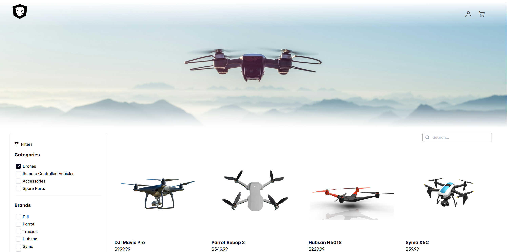

# e-shop
A simple Python eCommerce full-stack web app with a CRUD RESTful API backend for the products. Built with Python, Flask, SQLAlchemy, Pydantic, and SQLite3, and a web frontend with Angular.

